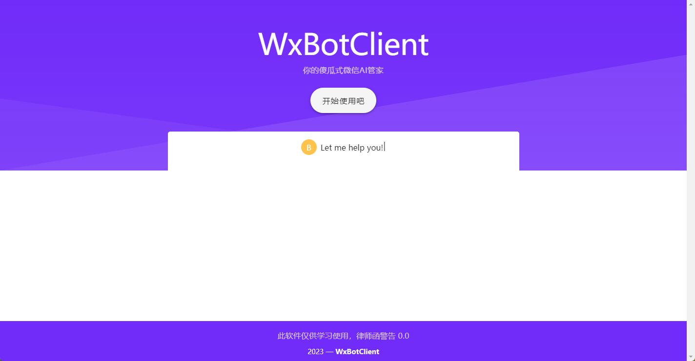
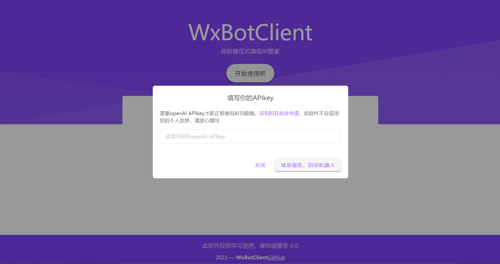
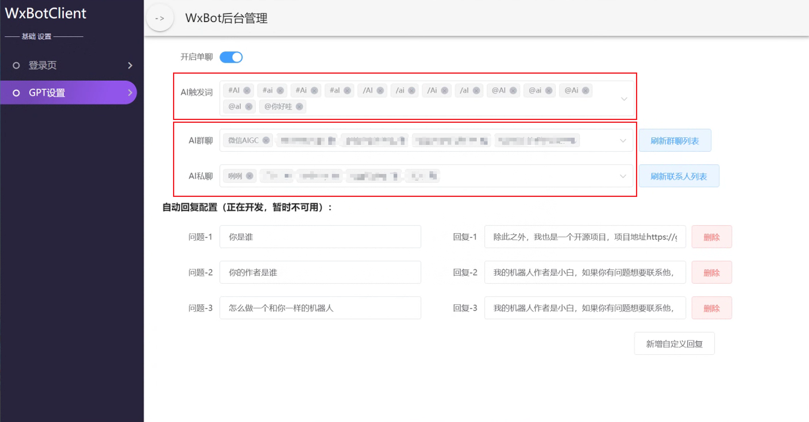

# Hi there, I'm WxBotClient 
我是一款开源的微信托管软件，基于electron、wechaty和vue开发，现已接入ChatGPT，编译出的安装包开箱即用，不依赖复杂环境，托管程序不随意掉线，稳定可靠。


---
## 搭建方式
### 下载&安装
[releases包下载地址](https://github.com/WhiteWatson/wx-bot-client/releases)，在这里你可以下载到已经构建好的 **.exe安装包(windows)**，下载过程中下载软件可能提示文件不安全，可以忽略此提示，下载完成后本地安装即可。

### 托管你的微信
打开软件，点击**开始使用吧**按钮，在弹出的窗口填写你的openAI APIKey，





填写完毕后点击**就是现在，启动机器人**，等待二维码出现，二维码出现后使用微信扫描二维码即可登录并托管微信。

tips: 国内使用请挂梯子，否则API不通过，AI会一直处于思考状态

### 机器人基本设置
登录成功后进入机器人管理后台，在左侧点击**GPT设置**菜单，可以看到基础的机器人设置。

在**AI触发词**修改机器人触发词

在**AI群聊、AI私聊**处可以指定机器人服务的群聊或微信用户



---
## 功能简介
### AI文字对话能力

```
提问格式： @AI + 问题内容

例：@AI 你是谁？
```

### AI生成图片能力
```
提问格式： /image + 图片提示词

例：/image 一个骑马的人
```
tips: 由于AI容易生成违禁图片，因此机器人直接发送图片链接，且链接具有时效性

---

## 自定义部署
此项目本地运行依赖node环境

### 安装依赖

请注意这里必须用 yarn 或者 pnpm 安装依赖
```
yarn install
```

### 接入ChatGPT并本地运行项目：

```
npm run electron:serve
```

### 打包客户端安装包:
```
npm run electron:build
```
### 在项目中配置openAI APIKey
进入`/src/bot/config.ts`目录，将从[openAi官网API申请入口](https://platform.openai.com/account/api-keys)申请到`Organization`和`APIKey`的填写到`setApiKey`函数中

### 如果遇到问题[可以先查阅此文档](./doc/problem.md)

---
## I'm a Computer Science and Engineering Student  

- 👨‍💻 I’m currently working on web development technologies like JavaScript, Vue etc.
- 💪🏼 Future Goals: Learn more technologies - Never stop creating new ideas.
- ⚡ Fun fact: I love to play Genshin Impact.

### 特别感谢 leeguiyu@qq.com创作的icon

### Languages and Tools 🛠 


<br/>

<br/>

  <h2 align="center"> Github Statistics 📈 </h2>
  
  <div align="center"> 
     <a href="">
      
    </a>
    <a href="">
      
    </a>
</div
  
<br/>

---
## 加群交流体验内测新功能


没有及时更新二维码请直接加我微信备注 "加ChatGPT群聊"

微信号：okfine0520


