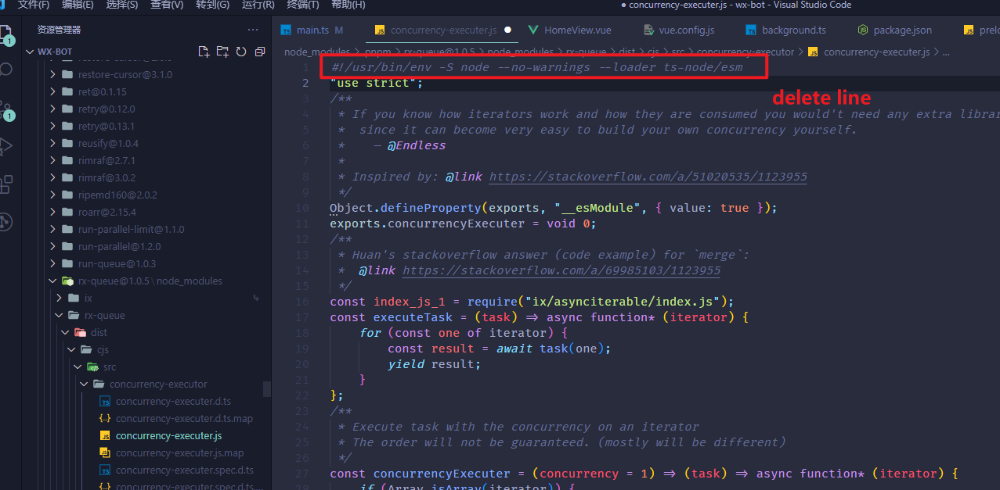

# 开发过程中遇到的问题

## https本地服务开启
新建vue.config.js 在里面添加
```
devServer: {
  https: true,
},
```

## 安装完vue-cli-plugin-electron-builder插件后不能启动 electron 报错
运行 `node node_modules/electron/install.js` 下载electron安装包解决

## background.ts 找不到
手动修改 background.js 文件成ts版本

## loaderContext.getOptions is not a function
降低ts-loader版本 `pnpm i ts-loader@~8.2.0`

## webpack ＜ 5 used to include polyfills for node.js core modules by default.
webpack5升级之后核心模块不在自动安装

`npm install node-polyfill-webpack-plugin`

vue.config.js 文件内容更新
```
const NodePolyfillPlugin = require('node-polyfill-webpack-plugin')
 
const { defineConfig } = require('@vue/cli-service')
 
 
 
module.exports = defineConfig({
 
  configureWebpack: {
    plugins: [new NodePolyfillPlugin()],
  },
 
  transpileDependencies: true,
 
  devServer: {
    proxy: 'http://localhost:3000' // 配置访问的服务器地址
  }
 
})
```

## 打包wechaty 报错#/usr/bin...


## electron: --openssl-legacy-provider is not allowed in NODE_OPTIONS
```
# 👇️ for macOS, Linux or Windows Git Bash
unset NODE_OPTIONS
```
https://bobbyhadz.com/blog/node-openssl-legacy-provider-is-not-allowed-in-node-options

## this.timer.unref
watchdog版本问题，需要手动升级到0.9.2，同时注意把老版本删除
